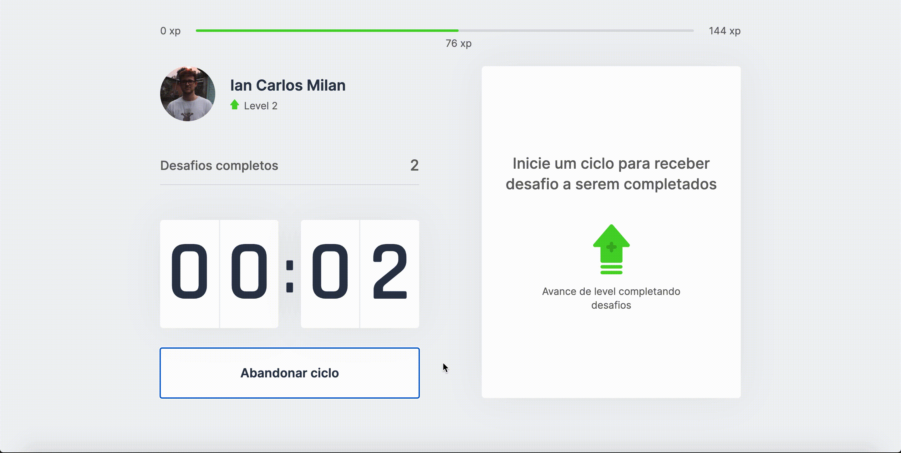

<div align="center">


![web] ![top_language] ![repo-size] ![license]

### 🏃‍♂️ Projeto desenvolvido durante a trilha React na #NLW04 da [Rocketseat].

</div>

## :bookmark: Sobre

O **MoveIt** é uma plataforma baseada na técnica Pomodoro, que consiste em utilizar um cronômetro para dividir ciclos de estudo/trabalho em períodos de 25 minutos,  separados por breves intervalos. Seu principal objetivo é manter o usuário com foco total em sua atividade durante cada tempo.

## 🖥 Demonstração

Ao final de cada ciclo de 25 minutos o usuário recebe um desafio para completar durante o intervalo, a cada desafio completado o usuário recebe bônus de xp para upar de level na aplicação, as informações de level, experiência e desafios completados ficam salvas nos cookies do navegador.

<p align="center">
  
</p>

## :computer: Tecnologias

O projeto foi desenvolvido com as seguintes tecnologias:

- [ReactJS](https://reactjs.org)
- [Next.js](https://nextjs.org/)
- [Typescript](https://www.typescriptlang.org/)

## :rocket: Preview

[](https://moveit-iancmilan.vercel.app/)

## :wrench: Como utilizar

#### Faça um clone do repositório:

```sh
  $ git clone https://github.com/iancmilan/moveit.git
```

#### Executando a plicação:

```sh
  $ cd moveit
  # instalando as dependências do projeto
  $ yarn

  # executando o projeto
  $ yarn dev
```

## :memo: Licença

Esse projeto está sob licensa [MIT](LICENSE).

<!-- Links -->
[Rocketseat]: https://rocketseat.com.br/

<!-- Bagdes -->
[web]: https://img.shields.io/badge/web-React-5965E0?style=flat-square&labelColor=121214
[top_language]: https://img.shields.io/github/languages/top/iancmilan/moveit?style=flat-square&color=5965E0&labelColor=121214
[license]: https://img.shields.io/github/license/iancmilan/moveit?style=flat-square&color=5965E0&labelColor=121214
[repo-size]: https://img.shields.io/github/repo-size/iancmilan/moveit?style=flat-square&color=5965E0&labelColor=121214
